# easy_glm

EasyGLM fits GLMs. It is designed for insurance pricing and turns fitted rating factors into insurance rate tables.

Yes, its been built with AI (insert Boris Johnson sounds)


## Install

```bash
pip install easy_glm
```

## Open the workbench

Start the graphical workbench:

```bash
easy-glm-workbench
```

It opens EasyGLM in your browser, normally at
`http://localhost:8501`. Keep this terminal open while you use the workbench.

You can also open it from a Python session:

```python skip-test
import easy_glm

easy_glm.launch_workbench()
```

To open a Polars or pandas dataframe that is already in memory:

```python skip-test
easy_glm.launch_workbench(data=df)
```

The workbench opens with `df` loaded. Choose the target, weight and predictors
on the **Variables** page, then define and fit the model on the **Model** page.

For a first run without supplying a file, open **Project & data** and click
**Use the French motor sample**. EasyGLM downloads that sample once and keeps a
local copy for later runs.

To reopen a saved project later, pass its project file after the command:

```bash
easy-glm-workbench path/to/project.easyglm-project.json
```

## Fit a Poisson claim-count model

We will fit a Poisson claim count model using the good ol' French Motort Third Party claims frequency dataset. The dataset contains `ClaimNb` for claim count, `Exposure` for - uh - yeah no guesses there and insurance-y variables like `DrivAge`, `Region`, `BonusMalus` and `Density`.

As ever, we love a good train/test set. The code creates a `traintest` column: 70% of rows teach the model; the other 30% are kept for the check at the end.

```python
import easy_glm

# Downloads the public data once and reuses the local copy later.
df = easy_glm.load_external_dataframe().sample(n=50_000, seed=42)
df = easy_glm.add_train_test_split(df, train_fraction=0.7, seed=42)

predictors = ["DrivAge", "Region", "BonusMalus", "Density"]
model = easy_glm.EasyGLM.fit(
    data=df,
    target="ClaimNb",
    model_type="Poisson",
    predictors=predictors,
    weight_col="Exposure",
    train_test_col="traintest",
    divide_target_by_weight=True,
    cv=5,
)
```

## See the fitted relativity tables

The base claim frequency is the starting level. A relativity of `1.20` means
20% more expected claims than a relativity of `1.00`, after taking account of
the other fitted factors. `exposure` shows how much insured time informed each
row of the table.

```python
print(f"Base claim frequency: {model.base_rate:.5f} claims per policy-year")
for name, table in model.relativities.items():
    print(f"\n{name}")
    print(table.select("label", "relativity", "exposure"))
```

The output includes numeric bands and text levels. These are representative
rows from the fitted French motor model:

```text
Base claim frequency: 0.04167 claims per policy-year

BonusMalus
band            relativity   exposure
< 53.0            1.000        12108.31
[53.0, 57.0)      1.355          790.70
[57.0, 60.0)      1.830          694.10

Region
level                         relativity   exposure
Centre                          1.000       5218.59
Rhone-Alpes                     1.356       2312.63
Provence-Alpes-Cotes-D'Azur     1.177       1835.53
```

## Plot the fitted shapes

Run the following to open the fitted shapes, then the training and test
actual-versus-expected rate charts. The validation charts use the exact fitted
bands or category order, draw Actual in red and Expected in blue, and show
Exposure behind the rate lines.

```python
easy_glm.plot_all_ratetables(model.relativities)
model.plot_actual_vs_expected(df)
```

The images below were generated by that example. Expected rates use the
complete fitted model, not just the factor named on the figure.

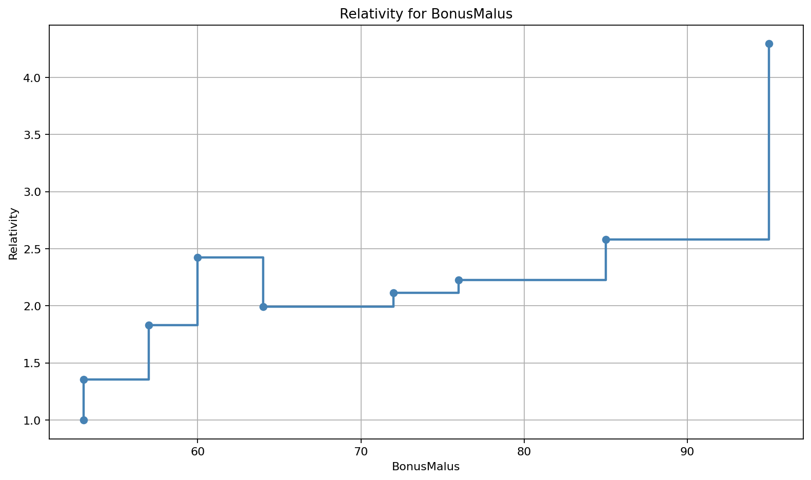

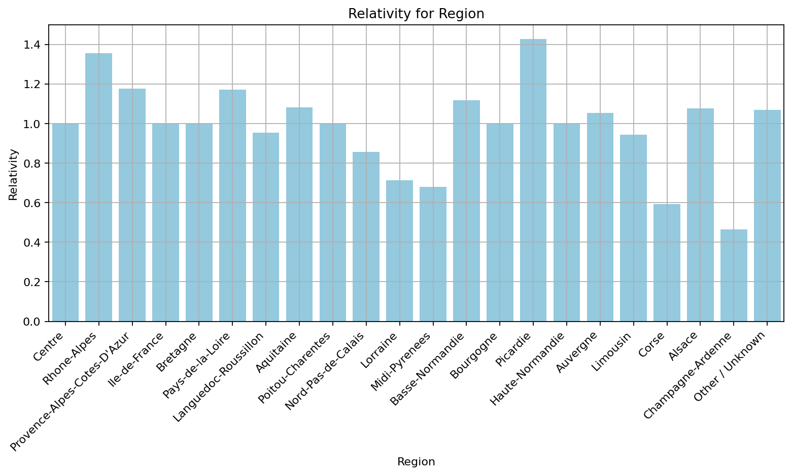

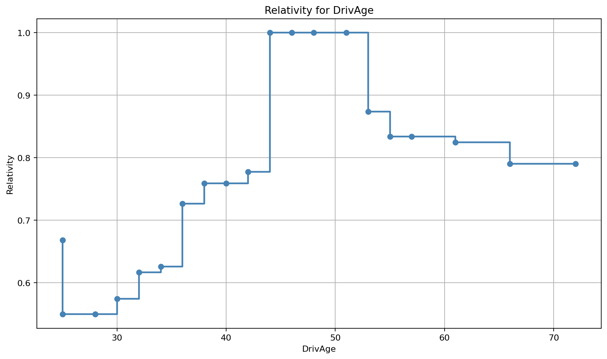

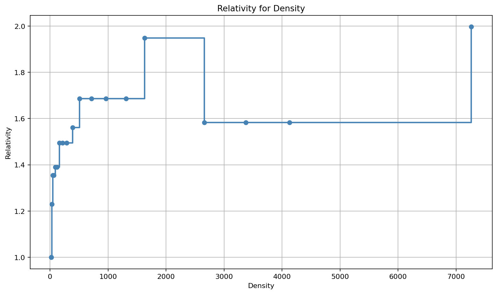

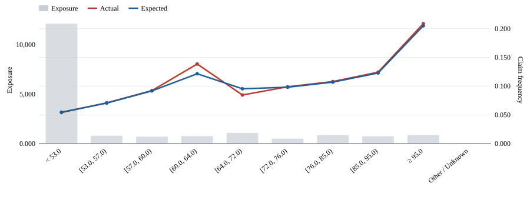

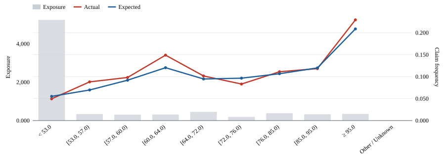

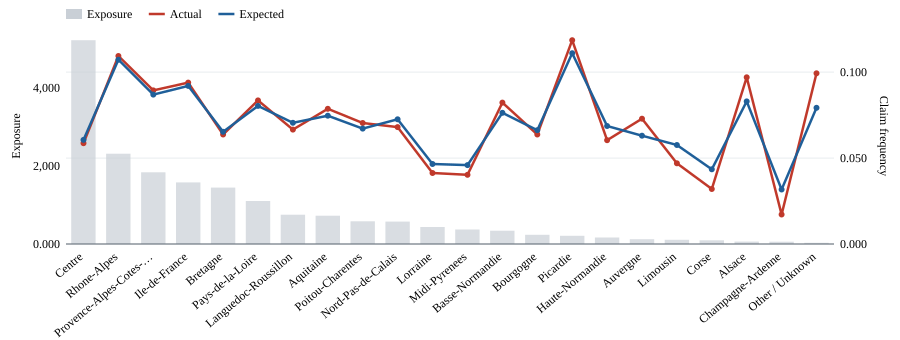

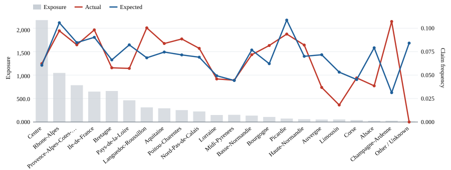

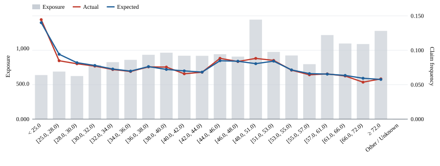

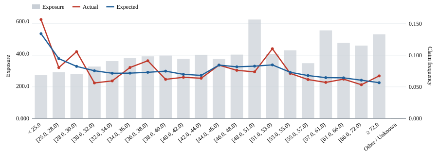

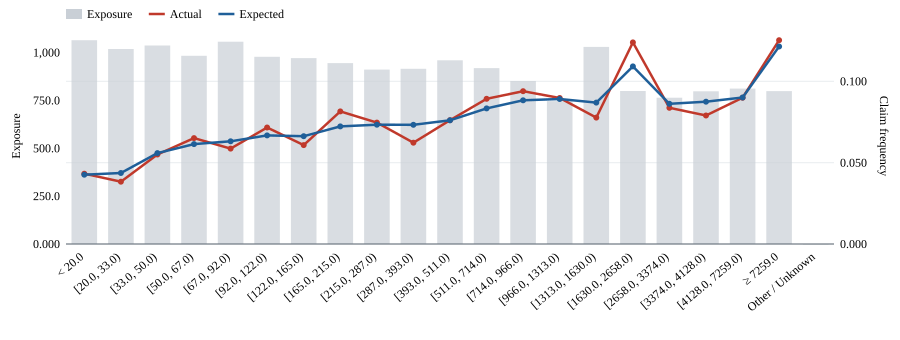

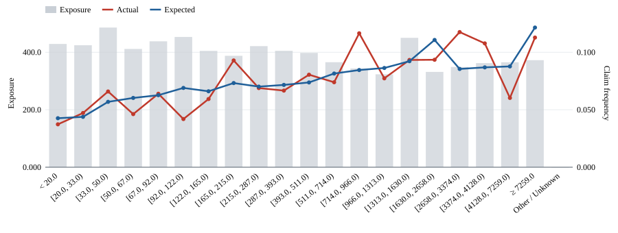

The same walkthrough is available as a standalone
[basic usage example](examples/basic_usage.py). It uses the same public French
motor data loader and local cache.

MIT licensed. See [LICENSE](LICENSE).
