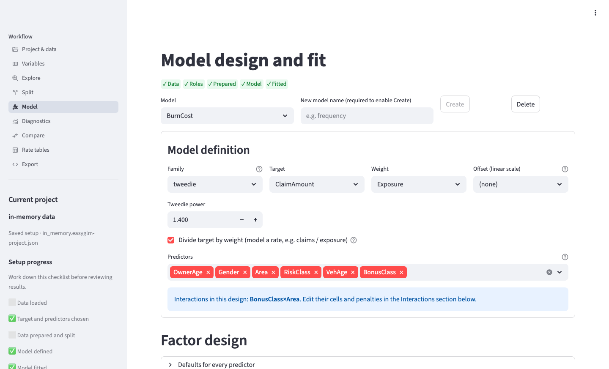
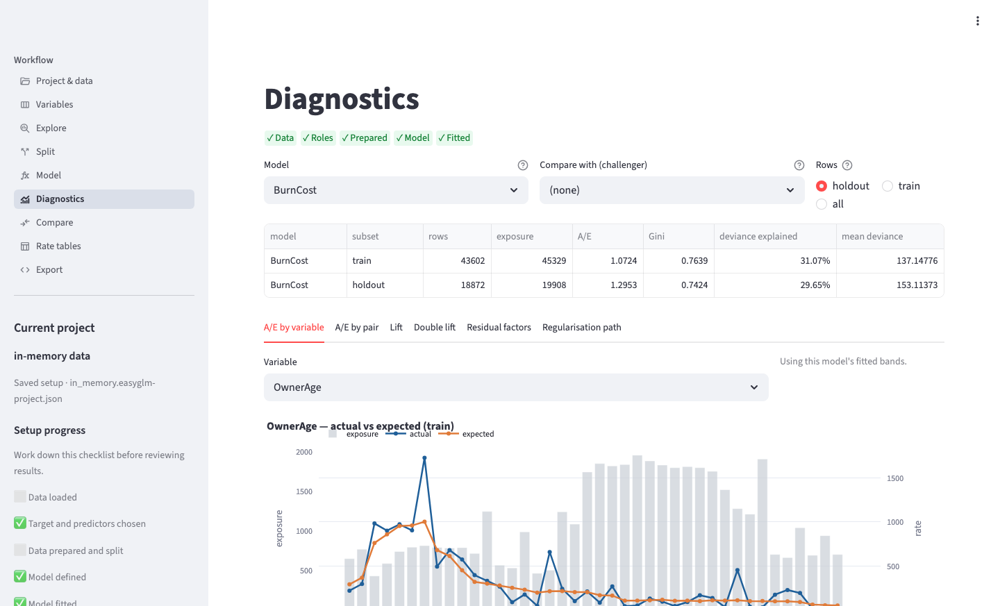
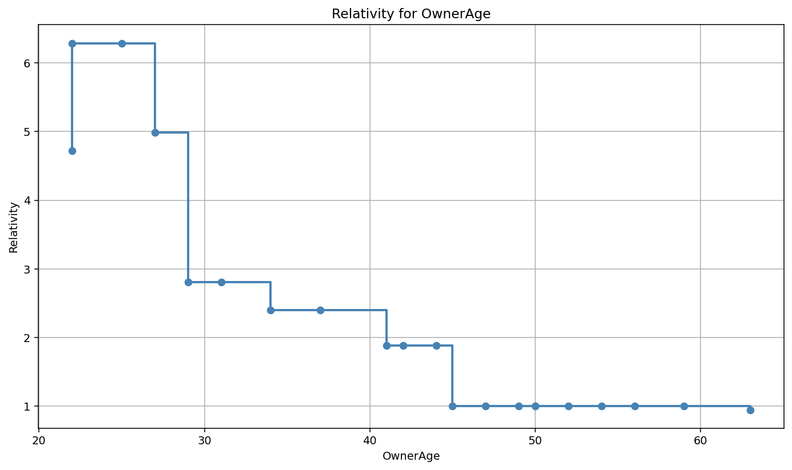
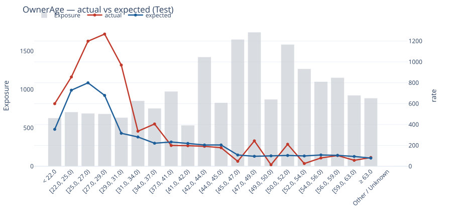

# easy_glm

EasyGLM fits GLMs. It is designed for insurance pricing and turns fitted rating factors into insurance rate tables. If you are an actuary, data scientist or analyst who wants to fit GLMs and produce insurance rate tables, you may find it useful too, but it is not a general-purpose GLM package. It is designed to be easy to use, and to produce insurance rate tables that are easy to read and understand.

Warning! This has been built with AI purely for *myself* as I had built up a store of random python scripts to help me do pricing work and I needed a more sensible way to reuse them in new projects. Bugs are likely!


## Install

```bash
pip install easy_glm
```

## Open the workbench

Start the graphical workbench:

```bash
easy-glm-workbench
```

It opens EasyGLM in your browser, normally at
`http://localhost:8501`. Keep this terminal open while you use the workbench.

You can also open it from a Python session:

```python skip-test
import easy_glm

easy_glm.launch_workbench()
```

To open a Polars or pandas dataframe that is already in memory:

```python skip-test
easy_glm.launch_workbench(data=df)
```

The workbench opens with `df` loaded. Choose the target, weight and predictors
on the **Variables** page, then define and fit the model on the **Model** page.

For a first run without supplying a file, open **Project & data** and choose the
French motor sample for Poisson claim frequency or the Swedish motorcycle
sample for Tweedie burn cost. EasyGLM downloads a chosen sample once and keeps
a local copy for later runs.

To reopen a saved project later, pass its project file after the command:

```bash
easy-glm-workbench path/to/project.easyglm-project.json
```

The workbench follows the same modelling pipeline as the Python API. It helps
you assign column roles, prepare a reproducible train/holdout split, design and
fit one or more models, inspect diagnostics, adjust rate tables, and export the
result as Python, a scorer, Excel tables or a self-contained report. It does not
fit anything until you select **Fit model**.

| Design and fit | Validate on training and holdout data |
| --- | --- |
|  |  |

For the practical screen-by-screen route, see the
[workbench walkthrough](examples/workbench_walkthrough.md). The
[examples index](examples/README.md) points to the shorter runnable scripts.

## Fit a Poisson claim-count model

We will fit a Poisson claim count model using the good ol' French Motort Third Party claims frequency dataset. The dataset contains `ClaimNb` for claim count, `Exposure` for - uh - yeah no guesses there and insurance-y variables like `DrivAge`, `Region`, `BonusMalus` and `Density`.

As ever, we love a good train/test set. The code creates a `traintest` column: 70% of rows teach the model; the other 30% are kept for the check at the end.

```python
import easy_glm

# Downloads the public data once and reuses the local copy later.
df = easy_glm.load_external_dataframe().sample(n=50_000, seed=42)
df = easy_glm.add_train_test_split(df, train_fraction=0.7, seed=42)

predictors = ["DrivAge", "Region", "BonusMalus", "Density"]
model = easy_glm.EasyGLM.fit(
    data=df,
    target="ClaimNb",
    model_type="Poisson",
    predictors=predictors,
    weight_col="Exposure",
    train_test_col="traintest",
    divide_target_by_weight=True,
    cv=5,
)
```

## See the fitted relativity tables

The base claim frequency is the starting level. A relativity of `1.20` means
20% more expected claims than a relativity of `1.00`, after taking account of
the other fitted factors. `exposure` shows how much insured time informed each
row of the table.

```python
print(f"Base claim frequency: {model.base_rate:.5f} claims per policy-year")
for name, table in model.relativities.items():
    print(f"\n{name}")
    print(table.select("label", "relativity", "exposure"))
```

The output includes numeric bands and text levels. These are representative
rows from the fitted French motor model:

```text
Base claim frequency: 0.04167 claims per policy-year

BonusMalus
band            relativity   exposure
< 53.0            1.000        12108.31
[53.0, 57.0)      1.355          790.70
[57.0, 60.0)      1.830          694.10

Region
level                         relativity   exposure
Centre                          1.000       5218.59
Rhone-Alpes                     1.356       2312.63
Provence-Alpes-Cotes-D'Azur     1.177       1835.53
```

## Plot the fitted shapes

Run the following to open the fitted shapes, then the training and test
actual-versus-expected rate charts. The validation charts use the exact fitted
bands or category order, draw Actual in red and Expected in blue, and show
Exposure behind the rate lines.

```python
easy_glm.plot_all_ratetables(model.relativities)
model.plot_actual_vs_expected(df)
```

These representative images were generated by that example. Expected rates use
the complete fitted model, not just the factor named on the figure.


## Fit the same model in the workbench

You can send the French motor data straight from Python to the graphical
workbench:

```python skip-test
import easy_glm

df = easy_glm.load_external_dataframe().sample(n=50_000, seed=42)
easy_glm.launch_workbench(data=df)
```

The workbench opens with the data loaded but makes no modelling decisions for
you. The [workbench walkthrough](examples/workbench_walkthrough.md) shows how
to assign the roles, create the split, fit this Poisson model, compare a
challenger, review training and holdout diagnostics, and export the reproducible
workflow.

## Fit a Tweedie incurred-claims model

The Poisson model predicts how many claims will occur. A Tweedie model can
instead predict the total cost of claims, including policies with no claims.

This example uses the public Swedish motorcycle portfolio. It contains
`ClaimAmount`, the total claim payments; `Exposure`, the number of policy
years; and six rating factors. EasyGLM downloads it once and keeps a local copy
for later runs.

```python
import polars as pl

# Download the Swedish motorcycle data and remove rows with no exposure.
df = easy_glm.load_swedish_motorcycle_data()
df = df.filter(pl.col("Exposure") > 0)
df = easy_glm.add_train_test_split(df, train_fraction=0.7, seed=42)

model = easy_glm.EasyGLM.fit(
    data=df,
    target="ClaimAmount",
    model_type="Tweedie",
    predictors=[
        "OwnerAge",
        "Gender",
        "Area",
        "RiskClass",
        "VehAge",
        "BonusClass",
    ],
    weight_col="Exposure",
    train_test_col="traintest",
    divide_target_by_weight=True,
    tweedie_power=1.5,
    cv=5,
)
```

The target divided by exposure is annual incurred claim cost. The Tweedie
power is fixed at `1.5` for this first example; automatic power selection is on
the future-release list.

The fitted rate tables and the training and holdout checks work in exactly the
same way as in the Poisson example:

```python
print(f"Base annual claim cost: {model.base_rate:.2f}")
for name, table in model.relativities.items():
    print(f"\n{name}")
    print(table.select("label", "relativity", "exposure"))

easy_glm.plot_all_ratetables(model.relativities)
model.plot_actual_vs_expected(df)
```

These representative graphs were generated by the Tweedie example above. The
expected annual claim costs use the complete fitted model, not just the factor
shown on each graph.





Both walkthroughs are also available together in the standalone
[basic usage example](examples/basic_usage.py). See the [changelog](CHANGELOG.md)
for a plain-English summary of each release.

MIT licensed. See [LICENSE](LICENSE).
