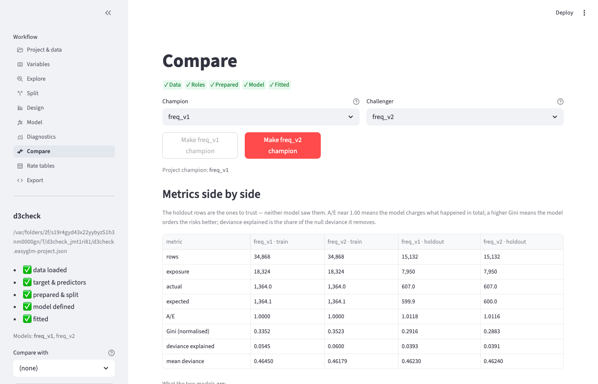
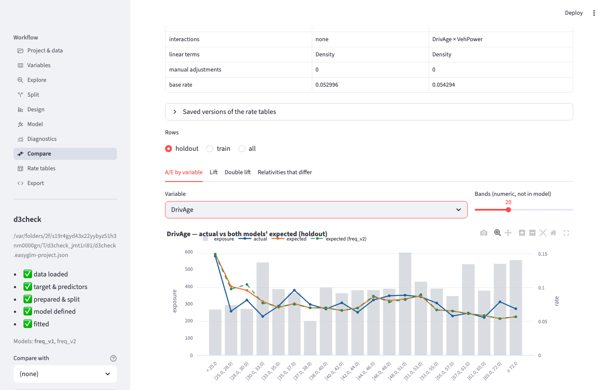
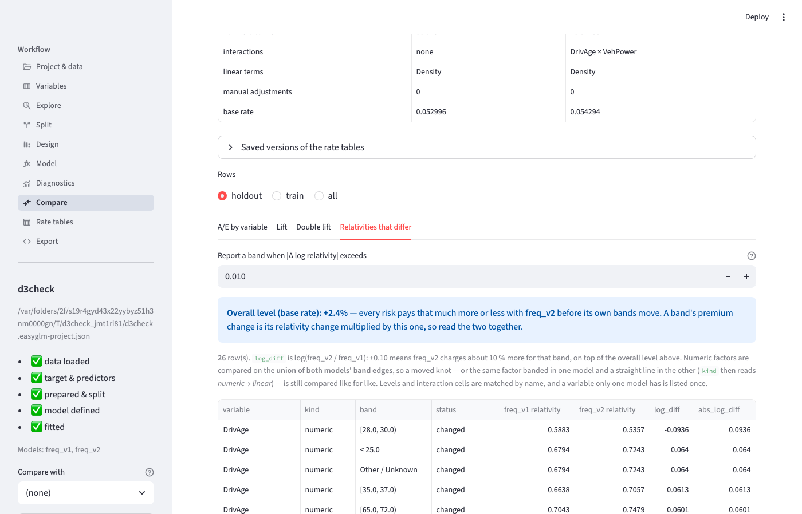
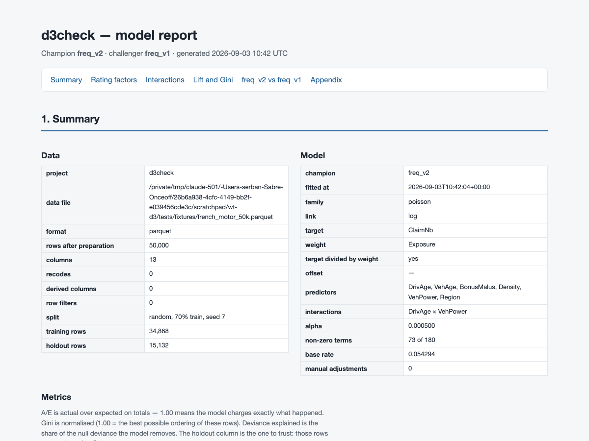
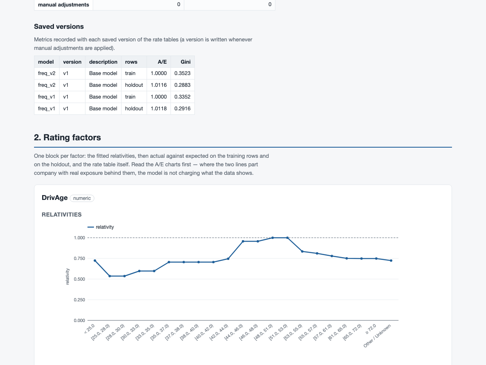
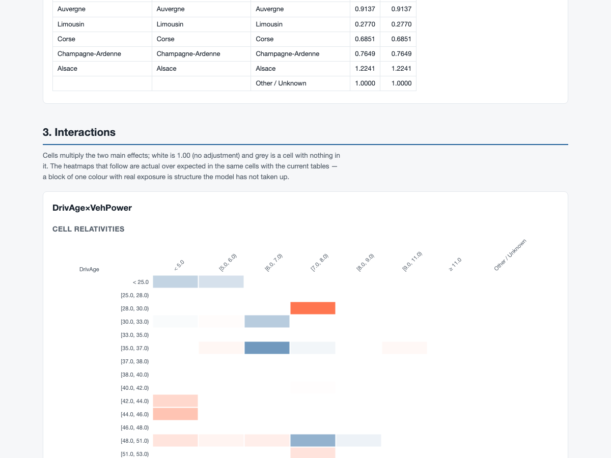
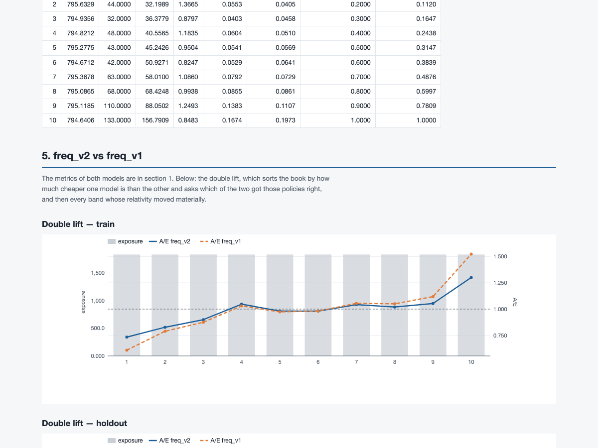

# D3 / D4 — comparing two models, and the report you can send

*French-motor fixture (50,000 policies, 70/30 random split). Two frequency
models on the same six factors, both treating Density as a straight line in log
space (the band design belongs to the project, so every model shares it);
`freq_v2` adds a DrivAge × VehPower interaction, which is the only structural
difference between them. The report shown here is `freq_v2`'s, with `freq_v1` as
its challenger. Screenshots regenerated by
`scripts/checks/d3_d4_compare_report.py --write`.*

## Why this exists

Until now the workbench could show you one model at a time. Deciding whether a
change is an improvement meant writing numbers on paper and flipping between
screens. There are now three things instead:

1. a **"Compare with"** box in the sidebar — pick a challenger once and the
   Diagnostics page, the Rate tables page and the Compare page all use it;
2. a **Compare** page — the two models' numbers next to each other, the same
   charts with both models drawn on them, and a table of *which relativities
   actually differ*;
3. a **Download HTML report** button on the Export page — one file with the
   whole model written up, which you can email or attach to a filing.

## Compare — the numbers side by side

What you see: one column per model, split into the training rows and the
holdout rows, and then the facts about each model (its penalty `alpha`, how
many terms survived it, its interactions, its linear terms, how many manual
adjustments it carries and its base rate).

What to look at, in this order:

* **Holdout first.** Both models saw the training rows while they were being
  fitted, so a model that looks better there may simply have memorised noise.
  The holdout rows are the honest comparison.
* **A/E** should sit at 1.00 on the training rows for both (the fit makes it
  so). On the holdout, a number away from 1.00 is a level problem: the model
  charges too much or too little *overall*.
* **Gini** says how well the model *orders* the risks — nothing about the
  level. Higher is better; the scale is normalised so 1.00 would be a perfect
  ordering of these rows. Differences below about 0.005 on 15,000 holdout rows
  are inside the noise; treat them as a tie.
* **Deviance explained** and **mean deviance** are the statistical measures of
  fit. They usually move with Gini; when they disagree, believe the one that
  matches the decision you are making (Gini for segmentation, deviance for
  overall accuracy).
* **Non-zero terms** is how complicated the model is. A challenger that buys
  0.002 of Gini with 40 more terms is usually not worth filing.

## Compare — the same picture with both models on it

What you see: for any variable — in either model or in neither — the observed
rate (blue), the champion's expected rate (orange) and the challenger's
(green, dashed), with exposure as bars behind them.

What to look at: the bands where the two model lines separate **and** there is
real exposure. That is where the two models would actually charge different
premiums. Where the challenger's line sits closer to the blue line across
several neighbouring bands, it is genuinely better on that factor; a single
band that fits better with little exposure behind it is noise.

The **Lift** tab shows each model against the observed rate over ten
equal-exposure bins, and the **Double lift** tab sorts the book by how much
cheaper the champion is than the challenger — the model whose A/E stays closer
to 1.00 across those bins is the one getting the disputed policies right.

## Compare — which relativities actually differ

This is the table to take to a rate meeting. Every row is **one band of one
factor whose relativity moved**, plus the tolerance box that decides what
counts as a move.

* `log_diff` is log(challenger ÷ champion). It is on the log scale because
  relativities multiply: **+0.10 means the challenger charges about 10 % more**
  for that band, −0.10 about 10 % less. The table is sorted by the size of the
  move, so the top row is the biggest change in the whole rate structure.
* The tolerance (default 0.01, i.e. 1 %) is what a band has to move by before
  it is listed. Two models that were fitted separately always differ in the
  sixth decimal; 1 % is the level at which a difference is worth a sentence.
  Raise it to 0.05 to see only the changes that would move a premium
  noticeably.
* **Numeric factors are compared on a common grid.** For an age or a density
  the tool takes the union of both models' band edges and evaluates both rate
  structures on it. That means a challenger whose knots moved — or that treats
  the factor as a straight line while the champion bands it — is still compared
  like for like, band of the common grid by band of the common grid. Move one
  knot from 28 to 28.5 and you get **one** row, `[28.0, 28.5)`: exactly the
  ages that would be charged differently, not four rows of bands that do not
  line up. When the two models represent a factor differently the `kind` column
  says so (`numeric → linear`), so no row can be mistaken for two designs that
  agree.
* **Levels and interaction cells are matched by name** — `Alsace`, or
  `[28.0, 30.0) | [7.0, 8.0)`. A level or a cell only one model has is listed as
  *band only in …*.
* A whole factor one model has and the other does not (here the
  DrivAge × VehPower interaction, which exists only in `freq_v2`) is listed once
  as *only in …*.
* **The overall level is shown on its own, above the table.** Two models can
  have identical relativities and still charge different premiums because their
  base rate differs, so the base rate is reported both as a headline
  ("Overall level (base rate): +2.4 %") and as a row of the table. **A band's
  premium change is its relativity change multiplied by the level change** — in
  this fixture the level is **+2.4 %** while the largest band move is
  **−8.9 %** (DrivAge `[28.0, 30.0)`), so the premium for those drivers falls
  by about **6.7 %**, not 8.9 %. Read the two together.

Two identical models give an **empty** table — that is the test, and it is what
you should see if you compare a model with itself.

The **Make … champion** buttons at the top promote either model; the champion
is what the rest of the workbench (and the exported script) defaults to.

## The HTML report

The Export page has a **Download HTML report** button. It produces *one file* —
no folder of images, nothing fetched from the internet when it is opened, which
means it works on a machine with no network, from a shared drive, or in five
years' time. Open it by double-clicking; it prints sensibly too.

What is in it:

* **Summary** — the data file, how many rows survived the filters, the split,
  and the model's family, target, weight, offset, penalty and base rate;
  then the metrics table (both models when a challenger is chosen).
* **One block per rating factor** — the fitted relativities, actual against
  expected on the training rows *and* on the holdout, and the rate table
  itself.

* **Interactions** — the cell adjustments as a heatmap (white is 1.00, i.e. no
  adjustment; grey is a cell with nothing in it), then actual over expected in
  the same cells on train and on holdout, and a list of just the cells that
  carry an adjustment.

* **Lift and Gini** on both sets of rows.
* **The comparison section**, when a challenger was chosen: the double lift and
  the same relativity-difference table, with the overall level above it. If the
  challenger cannot be scored on these rows (a column it needs is gone) the
  report says so in that section's place rather than quietly leaving it out.

* **Appendix** — every fitted coefficient, and the Python script that rebuilds
  the model from scratch. That script is the audit trail: anyone with the data
  can re-run it and get this model back.

The charts in the report are drawn as plain pictures rather than as an
interactive charting library, so the file stays a few hundred kilobytes instead
of five megabytes. Hovering a band or a heatmap cell still shows its numbers.

## What was checked

* Two identical models produce an empty difference table; a single edited
  relativity produces exactly one row, with the right size of change; two bands
  both floored to zero are not a change.
* Moving one knot produces exactly the sliver of the factor that would be
  charged differently; the same factor banded in one model and straight in the
  other is compared on the common grid and labelled `numeric → linear`.
* Swapping champion and challenger swaps every status and negates every number.
* A model with a factor the other does not have lists that factor once.
* The report contains no link to anything outside itself, opens in a browser
  with no errors, has one section per rating factor, and only carries the
  comparison section when a challenger was chosen.

## Questions for you

1. **Tolerance.** The difference table defaults to 1 % (|log ratio| > 0.01).
   Is that the level at which you would want a band listed, or would you rather
   start at 5 % and drill down? The box on the page changes it in one keystroke,
   so this is only about the default.
2. **The overall level.** It is now shown both ways — as the headline above the
   table and as a `(base rate)` row inside it. Is the headline wording right, or
   would you rather see the *premium* change per band (relativity × level)
   worked out for you in a column of its own?
3. **Report audience.** The report currently leads with the data and the model
   configuration and puts the coefficients in an appendix. For a filing, would
   you want a one-page summary at the front (headline metrics, the rate tables,
   nothing else) with everything else after it?
4. **The common grid.** Numeric factors are compared on the union of both
   models' band edges, so a moved knot shows the exact range of ages (or
   densities) that would be charged differently. For a piecewise-linear term we
   read each interval at its **start**. Is that the number you would want, or
   the exposure-weighted average across the interval?
