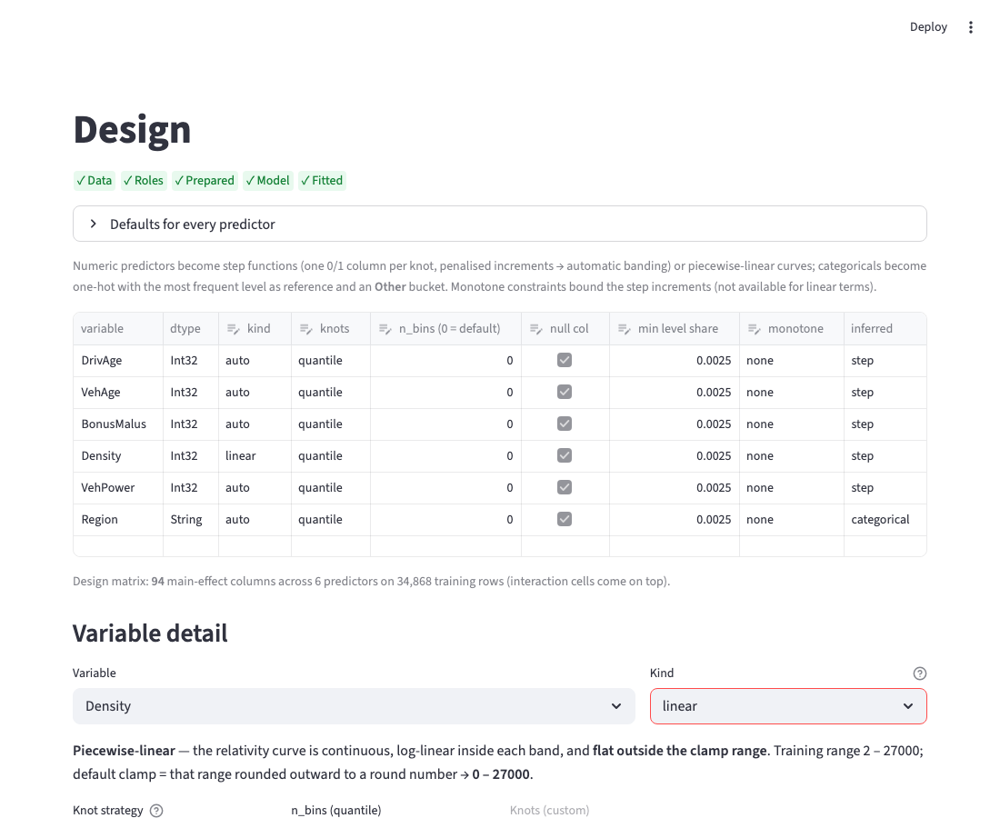
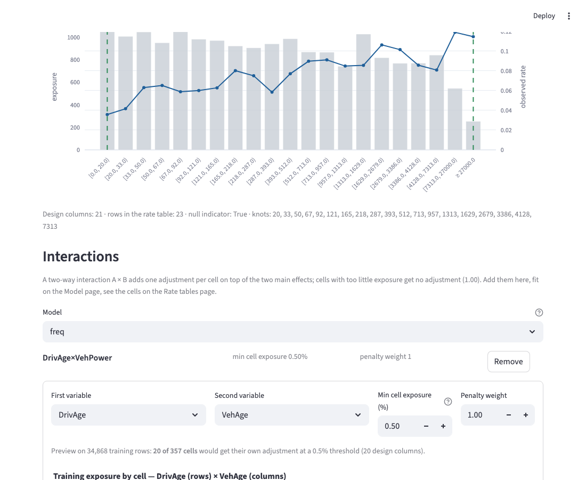
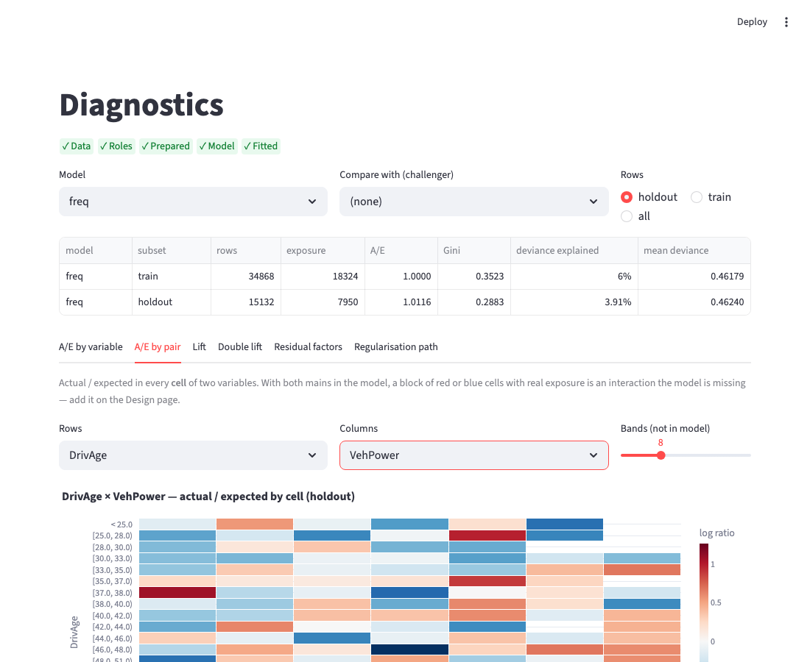
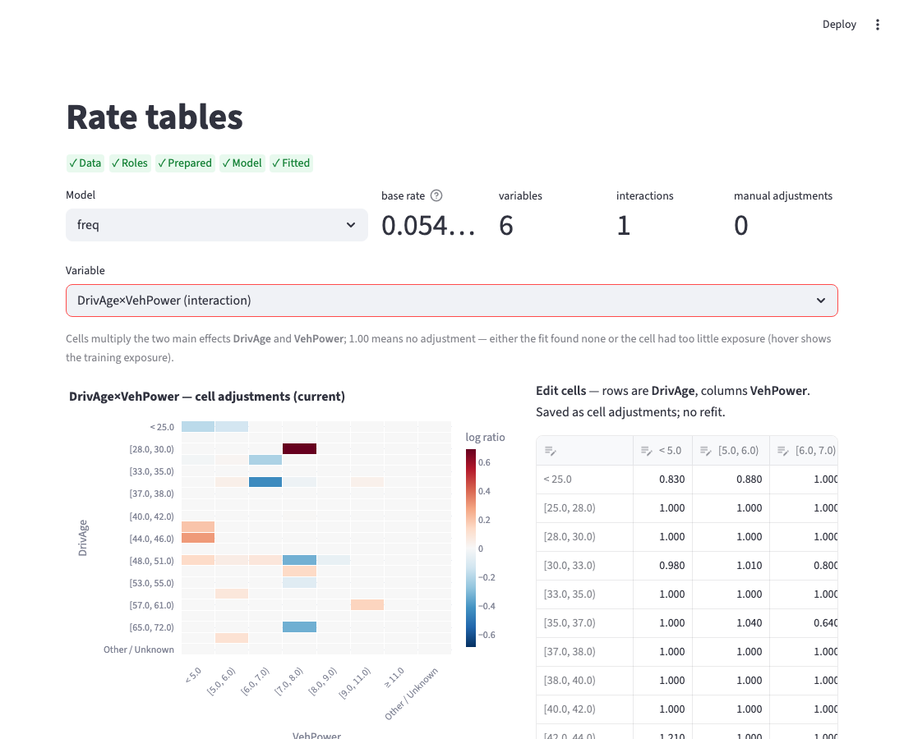
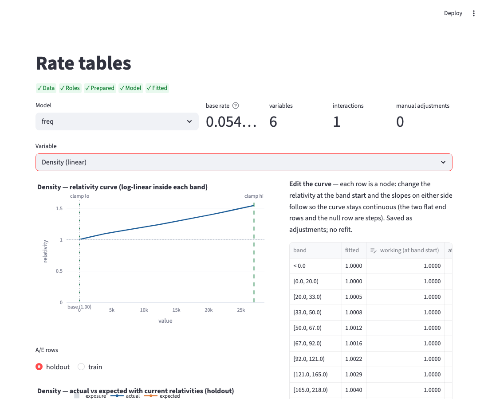

# W2 — the workbench screens for interactions and piecewise-linear terms

*French-motor fixture (50,000 policies, 70/30 split), frequency model with
DrivAge × VehPower as an interaction and Density as a piecewise-linear term.
Screenshots regenerated by `scripts/checks/w2_pages.py --write`.*

## Design page — piecewise-linear editor

What you see: the variable's **kind** (step / linear / categorical), the knot
strategy, the clamp range (defaults to the training range rounded outward — the
rule is written on the screen) and a preview of exposure and observed rate by
band with the two clamp points marked. Values below the lower clamp or above the
upper clamp get the relativity at the clamp; the curve is continuous and
log-linear inside each band.

What to look at: whether the default clamp is sensible for the variable (a
long thin tail above the last knot is where a straight line can run away — set
the upper clamp lower if so), and whether the knots sit where the observed
rate bends.

## Design page — interactions

What you see: the interactions of the selected model, and a form to add one:
two predictors, the minimum cell exposure (default 0.5 % of the pair's
exposure) and the penalty weight. The preview counts how many cells would get
their own adjustment and shows the training exposure per cell; the tool refuses
the same variable twice, a duplicate pair, or a parent that is not a predictor.

What to look at: the number of cells with real exposure. A pair with very few
populated cells is not worth an interaction; a threshold that keeps hundreds of
tiny cells will fit noise.

## Diagnostics — actual / expected by pair

What you see: for any two variables (in or out of the model), the ratio of
actual to expected claims in every cell, red above 1, blue below, with the
actual, expected and exposure on hover. Below the tab, **Search pairs** ranks
every pair of the model's predictors by the excess deviance of its cells (a
z-score, so a pair with many small noisy cells does not outrank one with a
single large real effect).

What to look at: a block of cells with the same colour and real exposure is an
interaction the model is missing; scattered colours in thin cells are noise.

## Rate tables — interaction cells

What you see: the fitted cell adjustments as a heatmap (1.00 = no adjustment,
hover shows exposure and the fitted value), the actual / expected by cell with
the current tables, and an editable grid of the cells. An edited cell is saved
as a cell adjustment and applied without refitting; a value of 0 or below is
refused with a message. The Excel download carries the interaction as a long
sheet and a matrix sheet.

## Rate tables — piecewise-linear curve

What you see: the fitted relativity curve with the clamp points and the base
point (relativity 1.00), the actual / expected by band, and the band editor.
Each row is a node: editing the relativity at the start of a band re-derives
the slopes on either side so the curve stays continuous; the two flat end rows
and the null row behave as steps.

## Questions for you

None new. Q1–Q3 (clamp behaviour, base point, few bends) and Q10 (default
upper clamp) still apply and their defaults are what these screens implement.
