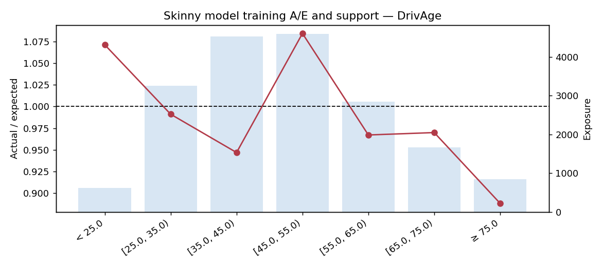
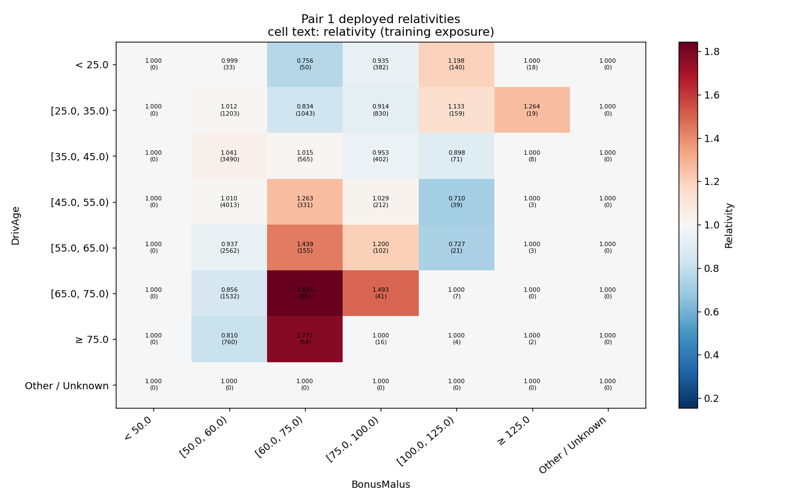

# French motor walkthrough: verification record

This accompanies the [interactive Python walkthrough](../../examples/python_modelling_walkthrough.md)
and its [numbered Python cells](french_motor_walkthrough.py). It records a developer
replay of the illustrative decisions. In an actual modelling session, stop at the
review points and record your own choices.

The source baseline is `22bbd7d`, followed by the documentation changes on
`codex/french-motor-python-walkthrough`. This is checkout evidence, not a claim
that the example has been released to PyPI.

The verification uses the complete checked-in French motor fixture: 50,000
policies, 1,971 observed claims and 26,273.658314 exposure units. The fixed split
contains 34,887 training rows and 15,113 holdout rows. The main model uses five-fold
cross-validation and eight penalty values. Each pair stage has a deliberately
small two-trial automatic search; this demonstrates the workflow without claiming
an exhaustive search.

## How the replay is checked

- Execute all Python blocks from the walkthrough in a fresh session, without
  loading the companion script. Also check the fifteen cells in that script.
- Keep holdout predictions out of the fitting and search checkpoints.
- Match the core GLM's design and predictions to the headless workflow bridge.
- Compare the main tables and first pair table before and after appending a stage.
- Reconstruct the final rate from the main rate and both deployed table factors.
- Reload the saved project with its original split and the frozen scoring model.
- Compare exported CSV and generated Python predictions to the accepted scorer.

Numerical results and timings below are measured on one machine. Solver noise,
library versions and a broader tuning budget can change them. No assertion
requires an interaction to improve holdout performance.

The focused test passed. An independent replay also passed all six optional
Python blocks and the branch that accepts and exports only the main-effects
model. All 21 Python blocks in the complete code reference compile, and its
fifteen numbered blocks exactly match the companion script. Black and Ruff
checks passed. The walkthrough now contains 35 complete Python blocks, including
imports, plots, optional examples and exports. A separate test executes them
directly from the Markdown and checks the fitted tables and saved predictions.

Some replays emitted glum line-search convergence warnings. The tutorial leaves
these visible: passing scoring-parity checks does not establish that every
optimisation has converged. Investigate the affected fits before relying on their
numerical optimum. Headless verification also reports that plots cannot be shown;
the saved PNGs were inspected separately.

## Measured checkpoints

Run date: 22 September 2026. Python 3.14.7 on macOS arm64, NumPy 2.4.5,
Polars 1.40.1, glum 3.4.1, CatBoost 1.2.10 and Optuna 4.9.0. BLAS/OpenMP
thread limits were set to one. The complete replay took about 24 seconds,
including about 13 seconds of imports and first-use plotting setup. Pair 1 took
about 2.6 seconds; appending pair 2 took about 7.8 seconds. These timings exclude
optional branches and interactive review time.

Lower mean Poisson deviance is better. A/E near 1 means totals balance; Gini is
ranking, not prediction accuracy. Gini below is the package's exposure-weighted
normalised measure.

| Checkpoint | Train mean deviance | Holdout mean deviance | Train A/E | Holdout A/E | Holdout Gini |
|---|---:|---:|---:|---:|---:|
| Two main effects | 0.482658 | 0.489994 | 1.0000 | 0.9926 | 9.00% |
| Four reviewed main effects | 0.464219 | 0.470614 | 0.9998 | 0.9988 | 30.09% |
| + DrivAge × BonusMalus | 0.461834 | 0.470020 | 1.0000 | 1.0034 | 30.23% |
| + VehAge × Density | 0.460535 | 0.471336 | 1.0000 | 1.0038 | 29.10% |

The second interaction improves the training fit but **worsens holdout deviance**.
Its small training-CV improvement did not carry through to these holdout rows.
The example exports the preselected second-stage model to demonstrate scoring, not to certify it for deployment.
Record the observed holdout deterioration; this example does not estimate an
uncertainty interval for that difference. Do not keep adjusting against the same
holdout until the number improves. A production decision needs its own review and,
where further tuning is undertaken, independent validation.

The skinny model has training A/E 0.99999, yet its missing-factor search still
ranks BonusMalus (45.04), Area (13.85), Density (11.30) and Region (6.09).
These are heuristic residual scores with estimated dispersion, not p-values.
After adding BonusMalus and Density, Area's score falls below zero while VehGas
and Region remain candidates for investigation. The limited four-factor teaching
model is therefore not presented as an exhaustive final model.

## What the pair-stage validation actually chose

| Added pair | Prefix CV loss | Deployed-table CV loss | Change |
|---|---:|---:|---:|
| DrivAge × BonusMalus | 0.467049 | 0.465230 | -0.001819 |
| VehAge × Density | 0.465769 | 0.465508 | -0.000261 |

Compare each row within itself. Stage 2 rebuilds/tunes its upstream prefix inside
its validation folds, so its prefix CV loss need not equal the preceding row's
loss. The final full-training prefix remains frozen; that separate invariant is
checked by comparing the exported tables and their predictions.

For policy `100003`, the measured calculation was:

```text
main rate                     0.117405332
pair-1 deployed factor      ×  0.914269531
prefix rate                 =  0.107340118
log(prefix rate)             = -2.231752817
pair-2 deployed factor      ×  1.002732780
final rate                  =  0.107633455
```

This illustrates the full-training scorer. It is not an offset column to feed
back into CV: the fitting API constructs the appropriate fold-local prefixes.
Exposure is multiplied once afterwards to obtain expected claim counts.

## Binning examples from the same training rows

| Configuration | Actual cuts |
|---|---|
| VehAge inherits eight requested bins | 1, 2, 4, 6, 9, 11, 14 |
| VehPower requests six automatic bins | 5, 6, 7, 8 |
| DrivAge uses literal business cuts | 25, 35, 45, 55, 65, 75 |

VehPower has fewer distinct cuts than requested because repeated values share
boundaries. Null/unknown fallback rows are separate from these observed bins.
The final illustrative model uses explicit cuts for all four numeric main effects.

## Actual plots

The line remains visible over the exposure bars. This is training evidence for
review, not a holdout result.



Each interaction cell shows a deployed relativity to three decimal places and
its training exposure in parentheses. Colour is centred on the neutral factor 1.
Sparse or unsupported cells warrant review even when the picture looks smooth.


